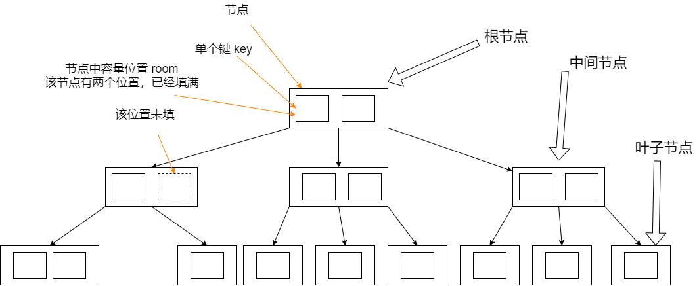

# B TREE

​		在了解B树之前，我们需要了解二叉查找树、AVL树（平衡二叉树）。B树就是在AVL树的基础上，每个节点包含多个key，同时，有多个子节点。同时B树也被称为高度自平衡的m路树

## 1、B树的定义

引用维基百科的定义，一个  order为m的B树有如下特性，order 我的理解是子节点的个数：

1. 每个节点最多有m个子节点

2. 每个非叶子节点（不包含根节点）至少有 m/2 向上取整
3. 如果根节点不是叶子节点至少有两个子节点
4. 非叶子节点有k个子节点有k-1个key
5. 所有的叶子出现在同一层

## 2、插入

所有的插入都是从叶子节点开始。要插入一个元素，查询树找到这个元素需要加到对应的节点（node）。插入的步骤如下

1、如果节点目前拥有的元素的数量小于规定的最大值，代表着还有位置给新元素，那么直接将这个元素插入这个节点，同时需要确保节点內元素有序。

2、发现节点满了，拥有的元素已经到了最大值。我们需要将这个节点分成两个节点。

​	1 从 包含插入的元素这些元素中选出一个中间值作为一个新的中间节点

​	2 元素小于这个中间值的放入新的左叶子节点，元素大于这个中间值的放入新的右子节点。中间值作为一个分割两个节点的值

​	3 分割值被插入到原先节点的父节点。如果导致父节点分裂，那么在重复这个流程。如果遇到这个节点没有父节点（例如这个节点示根节点），那么就在这个节点之上创建一个新的根节点。这也带来了树高度的增加。

## 3、删除

### 3.1 目前有两种B树删除节点的策略：

1.找到并删除这个元素，然后再次构建B树，保留不变的节点

或者

2.做一个简单的向下遍历树，在访问到这个节点前，再次构建这个树，从而一访问到 key便可以直接删除。这个key的删除不会触发树的构建。

目前采取前者的策略。

现在在删除一个元素时需要考虑到两个case

1.元素在中间节点，作为一个分割值，划分对应的子节点

2.删除一个元素会导致节点中的元素数量小于规定最小值

### 3.2 删除的流程

​	1.找到删除的元素

​	2.如果这个值在叶子节点，直接删除

​	3.如果节点出现 underflow（也就是key的数量小于规定的最小值），将树 reblance（重新平衡）

### 3.3 删除中间节点的流程

每个元素在中间节点作为一个分割值对于子树来说，因此我们需要找到这个分割值的替代者。注意到在左子树的最大元素仍小于这个分割值，同样的右子树的最小值大于这个元素，这两者其中一个可以作为两个子树的新的分割值。算法如下：

1.找到一个新的分割值（左子树的最大元素，或者右子树的最小元素），将它从叶子节点中移除，替代要被删除的元素，作为一个新的分割值。

2.上一个步骤删除叶子节点中的一个元素，如果叶子节点不满足条件（例如拥有的key的数量小于规定的最小值），那么需要从叶子节点 rabalance （再平衡）

### 3.4 rebalance

再平衡（rebalanceing）从一个叶节点开始并传递到根节点直到整个树达到平衡状态。如果从一个节点删除一个元素让这个节点的key的数量小于规定的数量最小值。这需要将一些元素重新分配到所有的节点，从而让每个节点达到最小值。通常的，重新分配这个动作包含将一个元素从兄弟节点移动到该节点，兄弟节点需要拥有多于最小值数量的key，从而保证移动后的兄弟节点仍满足条件。这样的重新分配被称作 rotation（旋转），如果没有兄弟节点能提供一个元素，那么该节点需要和一个兄弟节点 merge（合并）。这次合并会让父节点失去一个分割值元素。所以父节点也有可能变成 deficient（元素数量不足），也需要再平衡。合并和在平衡的会持续进行到根节点。因为最小值的限定条件不适用于根节点，让根节点变成唯一deficient的节点也是允许。让树再平衡的算法如下：

如果deficient的节点的右兄弟节点存在，并且右兄弟节点有着超过最小值数量的元素，那么 左旋转

​	1.将父节点对应的分割值拷贝到该节点（即 分割值下移，从而让这个节点拥有元素数量达到最小值）

​	2.使用右兄弟节点的最左边的值替代父节点的分割值。（右兄弟节点失去一个元素还是key的数量满足最小值的要求）

​	3.这个树现在就是平衡的

其他情况，如果deficient节点左兄弟节点存在，并且左兄弟节点有着超过最小值数量的元素，那么 右旋转

其他情况，如果左右兄弟节点都是刚好拥有 最小值数量的元素，那么需要 将这个节点和一个兄弟节点以及父节点作为分割值的元素进行合并：

​	1.将父节点分割值的元素拷贝到左子节点的末尾（这个左节点有可能是 该节点，也有可能示 左兄弟节点）。

​	2.将原先分割值的右子节点中的所有元素移动到左节点。（现在原先左边节点已经拥有 最大数量的 元素个数，右节点已经为空）。 

​	3.移除父节点中的分割值、以及其右节点（此时父节点少了一个元素）

​		3.1 如果父节点示根节点，且没有元素。那么释放根节点，将合并后的节点记为新的根节点（树的高度降低）

​		3.2如果父节点的元素个数小于需要的数量，那么需要从这个父节点再进行 再平衡

